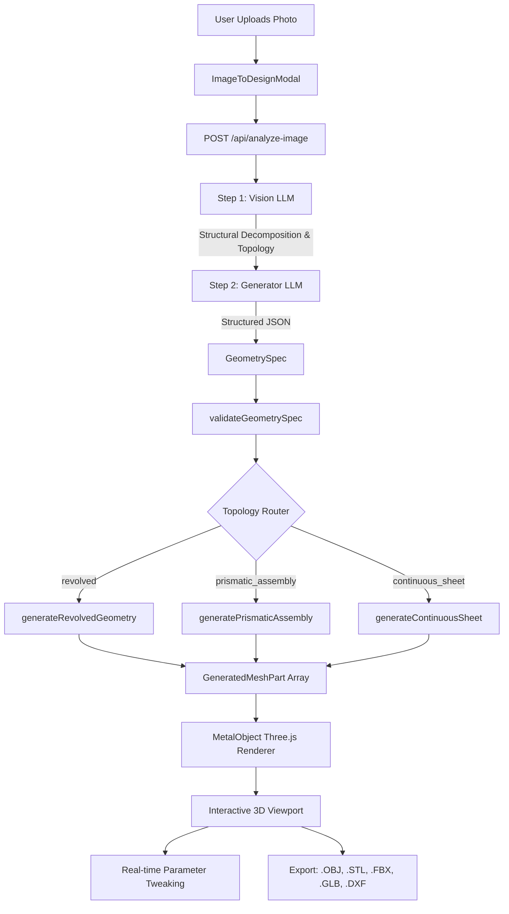

# Parametal Studio: Complete Architecture & System Technical Guide

> **Parametal Studio** is a browser-based, AI-augmented CAD and parametric design studio engineered for sheet metal architecture, furniture, lighting, and sculptural objects. It compiles high-level parameters and visual AI inputs into deterministic 3D geometry and manufacturing-ready CAD/DXF data.

---

## 1. Deep Project Folder & File Structure

```
├── .env                              # API keys (OPENROUTER_API_KEY, OPENROUTER_IMG_DESC, OPENROUTER_GEN)
├── app/                              # Next.js App Router root
│   ├── api/
│   │   └── analyze-image/
│   │       └── route.ts              # 2-Step AI Vision + Geometry Generator pipeline endpoint
│   ├── studio/
│   │   └── page.tsx                  # Dedicated full-screen Studio editor route
│   ├── favicon.ico                   # Application icon
│   ├── globals.css                   # Global styles & Tailwind CSS directives
│   ├── layout.tsx                    # Root layout with metadata and fonts
│   └── page.tsx                      # Landing / Studio redirect entry point
├── components/
│   ├── editor/                       # Studio UI & Editor Components
│   │   ├── CategorySelectorModal.tsx # Object category picker modal (Lamp, Seating, Partition, etc.)
│   │   ├── Editor.tsx                # Master 3-column layout with collapsible sidebar panels
│   │   ├── ImageToDesignModal.tsx    # Drag-and-drop Image-to-3D AI upload and generation modal
│   │   ├── ParameterPanel.tsx        # Left sidebar with real-time sliders and numeric inputs
│   │   ├── PropertiesPanel.tsx       # Right sidebar with material properties, lighting, and exports
│   │   ├── Toolbar.tsx               # Top header with category switch, undo/redo, 3D export buttons
│   │   └── Viewport.tsx              # Three.js / React Three Fiber canvas with orbit controls & lighting
│   ├── scene/                        # 3D Render & Scene Meshes
│   │   ├── Bolt.tsx                  # Reusable 3D hardware bolt/fastener primitive
│   │   ├── Bracket.tsx               # Reusable sheet metal bracket primitive
│   │   ├── Handles.tsx               # Interactive 3D drag handles for direct vertex manipulation
│   │   ├── MetalObject.tsx           # Master dynamic 3D mesh renderer for all object categories
│   │   └── Panel.tsx                 # Base parametric sheet panel mesh
│   └── ui/                           # Reusable UI primitives (buttons, modals, badges)
├── fabrication/                      # Fabrication & 2D Unfolding Engines
│   ├── export.ts                     # DXF flat pattern generator & download triggers
│   ├── holes.ts                      # Fastener hole & CNC punch pattern calculator
│   ├── unfold.ts                     # Sheet metal 2D unbending and flat pattern unwrapping
│   └── validation.ts                 # Sheet metal manufacturing sanity checks (bend radius, gauge)
├── geometry/                         # Deterministic 3D Geometry Engines
│   ├── continuousSheet.ts            # Extruded bent sheets, double-curved panels, and modular arrays
│   ├── curves.ts                     # Catmull-Rom & Bezier spline interpolation and grid builders
│   ├── engine.ts                     # Master geometry engine dispatcher and spec converter
│   ├── module.ts                     # Modular geometric utilities
│   ├── panels.ts                     # Canopy and lamp base sculptural sheet metal geometry
│   ├── partition.ts                  # Architectural partition screen array and structural post generator
│   ├── prismatic.ts                  # Orthogonal assemblies (slabs, tables, desks, laptops, frames, legs)
│   ├── revolved.ts                   # Rotational symmetry lathe generator (vases, cups, teapots, bottles)
│   ├── sculptural.ts                 # Legacy vessel generator & spline curve interpolation
│   ├── seating.ts                    # Continuous sculptural ribbon lounge chair geometry engine
│   ├── transforms.ts                 # Matrix and spatial coordinate helpers
│   ├── types.ts                      # Geometry calculation helper interfaces
│   └── validator.ts                  # Semantic GeometrySpec validator (bounds, finite checks, non-empty)
├── lib/                              # Utility Libraries & Exporters
│   ├── export3D.ts                   # Clean 3D exporter for .OBJ, .STL, .FBX, and .GLB
│   └── utlis.ts                      # General UI and className formatting helpers
├── scripts/
│   └── test_geometry.ts              # Deterministic test runner for testing geometry generation
├── store/
│   └── desginStore.ts                # Zustand global state store (parameters, theme, camera, categories)
├── types/
│   └── design.ts                     # Core TypeScript data structures, GeometrySpec, and ComponentSpecs
├── package.json                      # Next.js 16, React 19, Three.js, R3F, Drei, Tailwind, Zustand
├── tsconfig.json                     # TypeScript compilation configuration
└── README.md                         # Project documentation
```

---

## 2. File-by-File Technical Deep Dive

### `types/design.ts`
The single source of truth for domain data types:
- **`Topology`**: Union type `'revolved' | 'prismatic_assembly' | 'continuous_sheet'`.
- **`ObjectType`**: `'seating' | 'table' | 'lighting' | 'storage' | 'partition' | 'electronics' | 'container' | 'unknown'`.
- **`GeometrySpec`**: The intermediate representation output by the AI:
  ```ts
  export interface GeometrySpec {
    topology: Topology;
    objectType: ObjectType;
    confidence: number;
    dimensions: { width: number; depth: number; height: number };
    components: ComponentSpec[];
    materialType?: MaterialType;
  }
  ```
- **`ComponentSpec` Union**:
  - `RevolvedComponentSpec`: Radial profile points, height, waist, spout, handle, lid.
  - `PrismaticSlabSpec`: Orthogonal boxes `[w, h, d]` with position, rotation, corner radius.
  - `SupportLegsSpec`: Four-corner, U-frame, pedestal, blade, or hairpin leg styles.
  - `BentSheetSpec`: 2D continuous bend profile points extruded with uniform metal thickness.
  - `CurvedSheetPanelSpec`: Double-curved sheet panels with sagittal horizontal and vertical curvature.
  - `RepeatedModuleSpec`: Matrix arrays (rows × columns) of curved panels or slats on structural posts.
  - `FramePostSpec`: Cylindrical or box structural mounting rods.
  - `CutoutSpec`: Rectangular, circular, or pill-shaped sheet metal cutouts.
- **Parameters Interfaces**: `CanopyParameters`, `SeatingParameters`, `PartitionParameters`, `SculpturalParameters`.

---

### `store/desginStore.ts`
Global reactive state management powered by Zustand:
- **State Properties**:
  - `activeCategory`: Current active 3D category (`'lamp'`, `'seating'`, `'partition'`, `'table'`, `'storage'`, `'sculptural'`).
  - `parameters`, `seatingParameters`, `partitionParameters`, `sculpturalParameters`: Active numeric control parameters.
  - `controlPoints` / `seatingControlPoints`: 3D spline control vertices for interactive direct editing.
  - `wireframe`, `showHandles`, `showReferenceOverlay`: Visual debug toggles.
  - `theme`: `'light'` | `'dark'`.
  - `cameraPreset`: `'perspective' | 'front' | 'back' | 'left' | 'right' | 'top'`.
  - `studioLightRotation`: 0° to 360° studio lighting rotation angle.
- **Key Actions**:
  - `updateParameters()`, `updateSeatingParameters()`, `updateSculpturalParameters()`: Merges parameter updates and recalculates curve control grids.
  - `moveControlPointWithFalloff()`: Moves a dragged vertex and smoothly propagates proportional deformation to neighboring vertices using a cosine falloff function.

---

### `app/api/analyze-image/route.ts`
The serverless AI API endpoint orchestrating the 2-step Image-to-3D parametric pipeline.
- Accepts `{ imageBase64: string }`.
- **Step 1 (Vision Model)**: Analyzes the image using a multi-model vision LLM (e.g., Llama 3.2 Vision) and outputs a 10-point structural decomposition:
  - Identifies physical components (tabletops, legs, screen, bent shells, panels).
  - Determines planar, bent, or curved states.
  - Classifies topology (`revolved`, `prismatic_assembly`, or `continuous_sheet`).
  - Estimates real-world dimensions in millimeters.
- **Step 2 (Generator Model)**: Uses a code/reasoning LLM (e.g., Gemini 2.0 Flash) to translate the visual inspection into an exact, valid `GeometrySpec` JSON conforming to the schema.
- Includes fallback model candidate failover and cleans up thinking tokens (`<think>...<\think>`) or markdown fences.

---

### `geometry/engine.ts`
The master geometry orchestration engine:
- **`validateGeometrySpec(spec)`**: Runs validation checks on bounding box sanity, non-finite values, and component structure.
- **`generateGeometry(spec)`**: Routes the spec to the appropriate deterministic generator:
  - `topology === 'revolved'` -> `generateRevolvedGeometry()`
  - `topology === 'prismatic_assembly'` -> `generatePrismaticAssembly()`
  - `topology === 'continuous_sheet'` -> `generateContinuousSheet()`
- **`convertSculpturalParamsToSpec(params)`**: Converts legacy parameters to a strongly-typed `GeometrySpec` for backward compatibility.

---

### `geometry/validator.ts`
The sanity and bounds validator:
- Verifies that dimensions (`width`, `depth`, `height`) are finite numbers within valid manufacturing bounds (1mm to 20,000mm).
- Ensures no `NaN` or `Infinity` exists in position vectors or rotations.
- Validates that component structures (slabs, legs, profiles) match their specified types and contain non-zero thicknesses and positive leg heights.
- Returns `{ valid: boolean; errors: string[] }`.

---

### `geometry/revolved.ts`
Deterministic geometry generator for rotationally symmetric objects:
- **`generateRevolvedGeometry(spec)`**:
  - Takes 2D radial control points `(r, y)` and interpolates 64 points using `THREE.SplineCurve`.
  - Sweeps the spline 360° around the Y-axis via `THREE.LatheGeometry`.
  - Dynamically attaches ergonomic side handles (`THREE.TubeGeometry` on cubic bezier curve), pouring spouts (`THREE.TubeGeometry` on quadratic bezier curve), top lids (`THREE.LatheGeometry`), and spherical knobs (`THREE.SphereGeometry`).

---

### `geometry/prismatic.ts`
Deterministic geometry generator for orthogonal assemblies (furniture, tables, desks, laptops, storage):
- **`generatePrismaticAssembly(spec)`**:
  - **Slabs**: Converts `PrismaticSlabSpec` into positioned and rotated `THREE.BoxGeometry` instances.
  - **Legs**: Generates structural support legs according to style:
    - `four_corner`: 4 rectangular posts or cylindrical legs at corners with custom inset distance.
    - `u_frame`: Continuous bent tubular sled base created via `THREE.TubeGeometry`.
    - `blade`: Laser-cut flat sheet end blades.
    - `pedestal`: Central cylinder column with circular base plate disc.
  - **Posts / Frames**: Generates vertical and horizontal framework posts.

---

### `geometry/continuousSheet.ts`
Deterministic geometry generator for bent sheet metal and double-curved architectural panels:
- **`generateContinuousSheet(spec)`**:
  - **`createBentSheetProfileGeometry(profilePoints, width, thickness)`**: Takes 2D profile coordinates in the Y-Z plane, offsets inner and outer edges by sheet thickness, creates a closed `THREE.Shape`, and extrudes it along the transverse axis via `THREE.ExtrudeGeometry`.
  - **`createCurvedSheetGeometry(width, height, thickness, hCurve, vCurve)`**: Generates a double-curved parametric thin sheet with front and back surfaces and closed perimeter edge bridging to ensure manifold geometry.
  - **`RepeatedModuleSpec`**: Spawns parametric matrix arrays (rows × columns) of double-curved metal panels on vertical mounting posts with row/column spacing and stagger variation.

---

### `geometry/panels.ts`, `seating.ts`, `partition.ts`
Dedicated domain geometry engines for signature Parametal product lines:
- **`panels.ts`**: Generates asymmetric canopy hoods and folded lamp base pedestals with interior golden light fixtures.
- **`seating.ts`**: Generates continuous sculptural ribbon lounge chairs with seat curvature, backrest angles, top lip curl, and floor contact supports.
- **`partition.ts`**: Generates modular architectural screen walls with rotated double-curved panels and warm ambient light nodes.

---

### `components/scene/MetalObject.tsx`
The primary 3D mesh component mounted in the React Three Fiber Canvas:
- Dynamically observes active parameters from `useDesignStore`.
- If `activeCategory === 'sculptural'`, passes `sculpturalParameters.geometrySpec` into `generateGeometry()`, rendering all resulting parts with dynamic positions, rotations, materials, shadows, and wireframe overlays.
- Provides specialized rendering for Lamp, Seating, Partition, Table, and Storage categories.

---

### `components/editor/Editor.tsx`, `ParameterPanel.tsx`, `PropertiesPanel.tsx`, `Toolbar.tsx`, `Viewport.tsx`
The interactive studio user interface:
- **`Editor.tsx`**: Responsive 3-column layout featuring independent collapsible sidebars (`leftCollapsed`, `rightCollapsed`) with chevron toggles for maximizing 3D canvas viewport space.
- **`ParameterPanel.tsx`**: Left sidebar rendering fine-grained sliders for dimensions, curvatures, bend angles, module rows/columns, and thickness.
- **`PropertiesPanel.tsx`**: Right sidebar providing material finish selection (Galvanized Steel, Mild Steel, Brushed Aluminum, Custom Matte Black), 360° studio lighting rotation slider, and export triggers.
- **`Toolbar.tsx`**: Top navigation with category switching, Image-to-3D modal launcher, camera perspective buttons, wireframe toggle, and CAD export menu.
- **`Viewport.tsx`**: R3F 3D viewport configured with smooth orbit controls, contact shadows, studio grid, 360° rotating dual key/fill lighting rig, and direct manipulation vertex gizmos.

---

### `lib/export3D.ts`
High-fidelity 3D CAD mesh exporter:
- Traverses the active Three.js object hierarchy.
- Strips non-exportable studio elements (floor planes, infinite grids, gizmo handles, lights).
- Exports clean CAD files in 4 formats:
  - **`.OBJ`**: Wavefront 3D format via `OBJExporter`.
  - **`.STL`**: Binary stereolithography mesh for 3D printing and CAM slicing via `STLExporter`.
  - **`.GLB`**: Binary glTF 2.0 with embedded PBR materials via `GLTFExporter`.
  - **`.FBX`**: Autodesk FBX 7.4 text export for Blender, Maya, and Autodesk 3ds Max.

---

### `fabrication/export.ts`
2D Manufacturing & CNC Flat Pattern Exporter:
- Generates industrial 2D DXF flat pattern files with laser-cutting perimeters, CNC bend lines (with bend angles and inner radii), and punch hole patterns.

---

## 3. End-to-End System Workflow



---

## 4. Deep Dive: The AI Image-to-3D Parametric Pipeline

### Why Naive AI 3D Generation Fails
Traditional AI 3D generators attempt to generate dense, unstructured polygon point clouds or arbitrary vertex soups (.obj/.glb files with 500,000 messy triangles). These models cannot be edited parametrically, cannot be flattened for CNC laser cutting, and cannot be manufactured out of sheet metal.

### The Parametal Solution: Semantic Structural Decomposition
Instead of predicting raw polygons, our AI acts as a **CAD Engineer**:
1. **Vision Inspection**: Identifies what physical primitives compose the object (e.g., top slab, 4 tubular legs, a bent sheet ribbon, or a repeated module).
2. **Topology Classification**: Determines how geometry must be deterministically constructed:
   - `revolved`: Single rotational axis of revolution (vases, cups, bowls, bottles).
   - `prismatic_assembly`: Discrete orthogonal components (tables, desks, laptops, cabinets).
   - `continuous_sheet`: Decomposed bent sheets, continuous sweeps, and double-curved panels.
3. **Deterministic Geometric Compilation**: The TypeScript geometry engine constructs mathematically perfect, clean, manifold meshes with exact dimensions and uniform wall thicknesses.

---

## 5. Current Capabilities & Current Limitations

### Current Capabilities
- **Universal Topologies**: Seamlessly generates rotational vessels, multi-part orthogonal furniture/devices, and bent sheet metal ribbon structures.
- **Parametric Interactivity**: Objects generated by AI can be immediately adjusted in real time via UI sliders (height, width, thickness, leg spacing, bend radius).
- **Manufacturing Export**: Direct export to `.OBJ`, `.STL`, `.FBX`, `.GLB`, and 2D `.DXF` flat patterns.
- **Fail-Safe Fallbacks**: Multi-model OpenRouter retry cascade prevents API failure; validator prevents `NaN` or broken geometry from reaching the renderer.

### Current Limitations
1. **Complex Organic Freeform Sculptures**: The system specializes in architectural sheet metal and parametric furniture. Non-parametric freeform biological shapes (e.g., human faces, intricate animals) do not map directly to sheet metal or prismatic primitives.
2. **Dense Internal Assemblies**: The vision model inspects the exterior envelope; internal mechanisms (e.g., internal motor gearing or printed circuit board traces inside a closed laptop) are not generated.
3. **Compound Non-Orthogonal Miter Joints**: Complex compound angled joints (e.g., 5-axis robotic bevel cuts) are approximated as structural posts and slabs.
4. **Automatic Texture Extraction**: The AI extracts material presets (Aluminum, Mild Steel, Galvanized Steel), but does not yet generate custom high-resolution bitmap texture maps from the source image.
